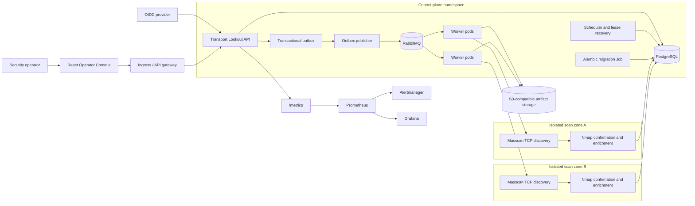

# Production architecture

Transport Lookout separates the control plane from network-capable scan workers. Operators interact only with the API and operator console; approved scan profiles and inventory scopes determine all scanner behavior.

## Runtime flow

1. The API authenticates operators through OIDC and authorizes only approved inventory scopes and versioned profiles.
2. A run is split into bounded shards. The API atomically records each shard lease, its unique execution token, and a durable outbox record in PostgreSQL.
3. The publisher sends the shard ID and execution token to RabbitMQ. A worker must atomically claim that exact token before scanning.
4. Workers in the matching scan zone reconstruct the controlled profile from PostgreSQL. A two-stage profile uses Masscan for TCP candidates, then Nmap with `-Pn` to confirm and enrich them. Only Nmap-confirmed data updates the exposure inventory.
5. Workers recheck token ownership before heartbeats, result persistence, artifact recording, and terminal state changes. Lease recovery invalidates the old token before re-dispatch, so a superseded worker rolls back pending writes without changing the replacement attempt.
6. Raw XML artifacts use execution-token-specific paths in filesystem storage for local development or S3-compatible storage in production. Normalized observations and the current exposure read model are persisted in PostgreSQL.
7. Worker completion and scheduler reconciliation share the same terminal-run finalizer and Masscan coverage gate. Scanner, parsing, and artifact-storage errors follow bounded retry/backoff and dead-letter handling.
8. Prometheus scrapes API metrics; the Helm chart can install alert rules and a Grafana dashboard.

## Production boundaries

- Keep workers in dedicated network zones/node pools with only the routing needed for their approved scopes.
- Give workers `NET_RAW` only where Masscan/Nmap requires it; the application process remains non-root.
- Treat PostgreSQL as the source of truth for leases and execution tokens; RabbitMQ tasks contain references and fencing metadata, not scan targets or arbitrary scanner arguments.
- Keep PostgreSQL, RabbitMQ, S3 credentials, and OIDC configuration in workload-managed secrets or identity systems.
- Restrict API, metrics, and worker egress/ingress through cluster-specific ingress and network policies.
